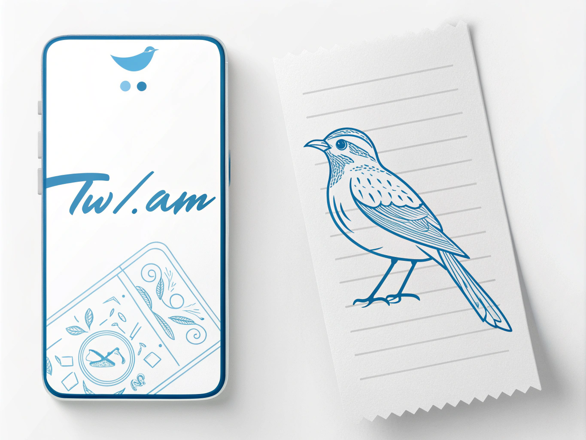

# Twitter MBTI Receipt - Twi.am

A simple web app that generates a Twitter MBTI receipt for a given Twitter ID.

> [!NOTE]  
> **Twi.AM** comes from "Twitter" + "I AM", referring to Twitter analyzer and "I am what". It's made for you to know better of yourself.

## Try Online

[Twi.AM](https://mbti.twi.am)

Enter your Twitter ID (Not Your Username) and click "ANALYZE MBTI" to generate a receipt.

Please wait for approximately 60 seconds for the analysis to complete.

## Read More

Dify Blog: [Building a Twitter MBTI Analyzer: A No-Code Journey with Dify and Windsurf](https://dify.ai/blog/building-a-twitter-mbti-analyzer-a-no-code-journey-with-dify-and-windsurf)

This article explores how to build an AI-powered product, “Twitter MBTI Receipt,” using Dify and Windsurf to analyze Twitter profiles and generate MBTI personality reports.

## How It Works

The app uses [Dify.ai](https://dify.ai) to scrape and analyze the Twitter profile using AI Agent and generate a receipt.

## Deploy Your Own

### Frontend

Deploy on Vercel:

Set up the following environment variables:

|Variable|Default Value|Description|
|-|-|-|
|`VITE_DIFY_API_URL`|https://api.dify.ai/v1/workflows/run|Dify API endpoint|
|`VITE_DIFY_API_KEY`| |Your Dify API key|
|`VITE_GA_ID`| |Google Analytics measurement ID (optional)|

### Backend

Download DSL file [here](./TwitterReceipt.yml) and upload to Dify.ai.

You should also get an API Key from crawlbase and set it in the DSL. Name it `token` in environment variables.

## Sponsoring

ETH: 0xEbf67cd24fa23fde69843cA4119cE946d8c231F5

## Star History

## Contributors

## Thanks For Sponsoring

- 

- [Minghan Zhang](https://github.com/zmh-program)

- [Luna5ama](https://x.com/Luna5ama)

## License

[AGPL-3.0](./LICENSE)
